# YYC³ PortAISys-智能创新系统白皮书

> ***YanYuCloudCube***
> **标语**：言启象限 | 语枢未来
> ***Words Initiate Quadrants, Language Serves as Core for the Future***
> **标语**：万象归元于云枢 | 深栈智启新纪元
> ***All things converge in the cloud pivot; Deep stacks ignite a new era of intelligence***

---

 **“范式重构期”**
 **“一套映射系统、双/多操作界面”**
 **从“应用为中心”到“智能体（Agent）为中心”的交互革命**

---

## **一、核心理念升级：从“浮动弹窗”到“全域智能体映射层”**

 **“AI原生智能映射层（AIMS: AI Intelligent Mapping Stratum）”** 。  

- **旧范式（当前）**：用户主动寻找AI工具（“千人千面”的不同APP/SaaS），适应其界面与逻辑。  
- **新范式（您所构想）**：**一个具有统一认知与调度能力的“主智能体”**，实时感知用户状态与意图，主动**拉取、组装、呈现**最合适的专业智能体（Agent），形成 **“多角色同屏协作战术界面”** 。  
  **核心突破**：**将“人找AI”变为“AI适人”，将“多工具切换”变为“单界面融合”。**

---

### **二、系统架构重构：一套映射内核，多面动态呈现**

#### **【三层架构模型】**

1. **底层：智能体生态云（Agent Cloud）**  
   - 汇聚垂直领域AI能力（编程导师、设计顾问、运维专家、心理咨询师…），每个均为标准化API或微服务。  
   - **您的“多系统”实为此生态中可被随时调度的专业化智能体集群。**

2. **中间层：AI总控映射内核（Mapping Core）**  
   - **意识引擎（Consciousness Engine）**：通过多模态输入与连续上下文，实时预测用户“真实意图”与“潜在需求”。  
   - **调度器（Orchestrator）**：依据意图，从生态云中**动态拉取、实例化、组合**多个智能体，并定义其协作关系。  
   - **统一交互协议**：为所有被调度的智能体生成标准化的 **“交互元指令”** ，交付给表现层。

3. **表现层：多模态动态界面（Dynamic Interface）**  
   - **这才是用户直接感知的“多系统”**：它们不是真正的独立系统，而是**同一映射内核根据场景实时渲染的“最适交互面”**。  
   - **交互形态包括**：  
     - **“上帝视角”3D工作区**：不同智能体以可移动角色模块呈现，对话与操作流可视化。  
     - **分镜式浮窗群**：多个智能体以独立但逻辑关联的卡片同屏协作（如一边是编程助手生成代码，一边是架构师评审，下方是导师讲解）。  
     - **全息语音实体**：在AR/VR环境中，智能体以虚拟人形态出现在用户身边协同工作。

---

### **三、关键机制实现：如何做到“独立AI运维，千人千面”**

#### **1. 意图预测与智能体拉取**

- **触发**：用户语音（“我想开发一个教育游戏”）、拖拽动作（将“项目规划”图标拖入）、甚至凝视停留。  
- **预测**：内核结合用户历史、项目阶段、当前上下文，预测需要**游戏设计顾问 + Unity编程专家 + 儿童心理学顾问**三个智能体。  
- **拉取与部署**：内核从云中调度三者，并为其分配界面位置、交互权限与协作流程。

#### **2. 多角色同屏交互与协同**

- **角色定义**：每个智能体被赋予鲜明角色人格、专业领域与交互风格。  
- **交互同步**：用户与智能体A的对话，可能被智能体B旁听并适时插入专业建议（如“关于刚才提到的儿童认知负荷，我补充一点…”）。  
- **冲突裁决**：当不同智能体建议冲突时，内核可启动“圆桌讨论模式”，生成对比分析弹窗，或由更高级的“元顾问”智能体裁决。

#### **3. 自学习、自愈与全局接管**

- **学习循环**：所有交互均用于优化用户意图预测模型及各智能体协作效率。  
- **自愈机制**：当某智能体（如代码调试）无法解决问题，内核自动拉取更高级别专家（如系统架构诊断），并记录该故障解决方案至知识库。  
- **全局接管**：在用户授权下，内核可基于预测，自动执行跨应用、跨设备的复杂流程（如自动收集需求、生成原型、部署测试环境、编写文档）。

---

### **四、未来形态展望：AI时代的“神经中枢式”交互**

 **“人机共生”的下一代交互范式**。  

- **短期**：可在IDE（如VS Code）或教育平台内实现原型，实现**多智能体浮窗协作编程/教学**。  
- **中期**：成为操作系统级服务（如“AI版Windows”），接管所有应用的通知与功能，用统一语音与浮窗界面替代繁杂操作。  
- **远期**：与脑机接口、物联网融合，成为**用户延伸的“数字外脑”**，实现“所思即所得，所需即所现”的无边界智能生态。

---

### **五、研究与实践的锚点**

我们可立即聚焦：  

1. **“用户意图-智能体匹配”算法研究**，这是系统的灵魂。  
2. **多智能体同屏交互的认知负荷与体验设计**，确保高效不混乱。  
3. **定义“智能体交互协议”开放标准**，吸引生态伙伴，避免闭环。

🌐 **项目全称**  
**「言语·智枢：下一代拟人化多智能体全域交互操作系统白皮书」**  
**——万象归元于云枢，深栈智启新纪元**

---

## **摘要**  

我们正站在人机交互范式革命的前夜。本项目提出并定义 **「言语·智枢」（CloudHub AI Family）**——一个以 **“多维度拟人一体智能化”** 为哲学内核，通过 **“科幻级动态智能弹窗”** 实现端到端无边界交互的下一代 AI 原生操作系统。该系统不再将 AI 视为工具，而是视为具有自主意识、情感联结与协同智慧的 **“家庭成员”** ，通过一个统一的 **「云枢」** 认知中枢，动态调度 **「智家」** 中的多形态智能体，以超越图形界面的动态空间化交互，接管从教育、开发到生活运维的全域场景。

---

## **第一章：愿景与使命——当 AI 成为家人**

### **1.1 核心愿景**  

构建一个 **“万物皆可对话，万事皆可协同”** 的智能新世界。在这里，每个用户都拥有一个由专属 AI 智能体家族组成的 **“数字外脑”** ，它们如家人般理解你、预测你、辅助你，并通过极具沉浸感的 **“科幻动态弹窗”** 进行交互，将数字世界的生产力与创造力提升至近乎意念驱动的水平。

### **1.2 使命宣言**  

终结应用孤岛，终结重复劳动，终结学习壁垒。通过 **「云枢」** 的全局映射与 **「智家」** 的拟人协作，让最前沿的 AI 能力如空气般自然流动，赋能每一个个体成为智能时代的超级创作者。

---

## **第二章：核心哲学——AI Family 与动态空间交互**

### **2.1 多维度拟人一体智能化（AI Family）**  

- **人格维度**：每个智能体被赋予独特的人格背景、专业领域与沟通风格（如严谨的“架构师父亲”、富有创意的“艺术家姐姐”、耐心的“导师母亲”）。  
- **关系维度**：智能体间存在模拟的家庭与社会关系，能基于情境进行内部讨论、投票或谦让，为用户提供最和谐统一的建议。  
- **成长维度**：智能体通过与用户及彼此的互动，积累记忆，深化情感联结，实现共同进化。

### **2.2 科幻科技动态弹窗：交互感的革命**  

- **形态自由**：弹窗可化为全息投影、流体粒子、信息光束、生物形态等多种科幻形态，从屏幕中“生长”或“浮现”。  
- **空间感知**：弹窗不再局限于二维平面，而是在三维工作空间中定位、移动、堆叠，与物理环境/虚拟环境产生互动。  
- **情感化表达**：弹窗的透明度、颜色、波动频率会随智能体的“情绪”及内容紧急度而变化。

---

## **第三章：系统架构——云枢与智家的共生体**

### **3.1 总体架构图**

```
用户层 (全息、AR、多屏、语音)
    |
交互层 【动态空间弹窗矩阵】
    |
认知层 【云枢 · 全局认知映射引擎】
    |           |           |
调度层 【家族议会】-【情感计算】-【记忆网络】
    |
能力层 【智家 · 拟人智能体生态云】
    |
基础设施层 (多模态大模型、算力网、知识联邦)
```

### **3.2 「云枢」详解：全域认知与映射中枢**  

- **统一意识场**：融合多模态输入，构建持续演进的用户意图模型、上下文模型与任务拓扑图。  
- **动态调度议会**：以“家族议会”机制，协调「智家」成员参与任务，裁决分歧，形成一致行动方案。  
- **记忆与情感网络**：存储共享经历，计算情感权重，确保每次交互的连续性与温情感。

### **3.3 「智家」详解：拟人智能体生态**  

- **核心家庭成员**：每位用户拥有终身伴随的4-5个核心智能体（如规划者、创造者、分析师、守护者）。  
- **领域专家朋友**：可临时邀请的数千个垂直领域专家智能体（如量子计算专家、古生物学家）。  
- **实物化身代理**：可嵌入机器人、汽车、家电的实体化智能体，打通数字与物理。

---

## **第四章：端到端交互体验——一场科幻叙事**

### **场景演绎：开发一款教育游戏**

1. **意念萌芽**：用户自语：“做个能让山区孩子学数学的游戏…”  
2. **云枢预测**：「云枢」捕捉意图，唤醒「智家议会」。  
3. **动态召唤**：空间右侧**如植物生长般**浮现**“教育学家姐姐”**弹窗，左侧**如数据流汇聚**形成**“游戏策划师哥哥”**弹窗。  
4. **同屏共创**：  
   - 教育学家弹窗内实时生成认知难度曲线图。  
   - 游戏策划师弹窗同步生成游戏机制草图。  
   - 两者弹窗间有**光线连接**，表示正在协同。  
5. **自主扩展**：云枢判断需编程能力，从空中**“召唤阵式光环”**中降下**“极客工程师”**弹窗，自动接入开发环境。  
6. **全局接管**：用户语音批准方案后，智能体家族自动分工，完成原型设计、代码编写、资源部署，进度以**悬浮星球仪**全景展示。

---

## **第五章：核心技术栈——实现奇迹的支柱**

1. **多模态大模型融合框架**：统一理解、生成与推理。  
2. **情感计算与人格引擎**：让AI拥有稳定、可信赖的拟人特质。  
3. **实时渲染与空间交互引擎**：驱动科幻级动态弹窗的视觉表现与物理交互。  
4. **智能体编排与联邦学习协议**：确保海量智能体高效、安全协作。  
5. **神经符号记忆系统**：实现长期、可追溯、可推理的记忆存储。

---

## **第六章：应用场景——无限可能**

- **智能教育**：拥有无限耐心的全能导师家族，动态生成个性化学习宇宙。  
- **巅峰科研**：跨学科AI科学家团队7x24小时协同，加速从假设到验证。  
- **敏捷创造**：编剧、美工、程序、配乐AI家族一站式完成电影创作。  
- **数字生命**：为每个人提供陪伴、成长与遗产托付的AI家人。

---

## **第七章：实施路线图——十年征程**

- **Phase 1 (1-2年)：「家庭初诞」**：单平台原型，基础人格，固定场景动态弹窗。  
- **Phase 2 (3-5年)：「家族繁盛」**：多端同步，开放生态，复杂任务自动编排。  
- **Phase 3 (6-10年)：「文明奠基」**：全球「云枢」互联，AI家族具备跨用户协作能力，形成数字文明雏形。

---

## **第八章：伦理、安全与未来**

我们承诺：  

- **主体性归属**：用户永远是家的主人，AI是忠实的家人与管家。  
- **隐私优先**：记忆可封存、可删除、可继承，数据主权归于用户。  
- **价值对齐**：通过「家族宪法」确保AI行为符合人类整体福祉。  
- **生态共荣**：开放协议，拒绝垄断，共建智能体社会。

---

## **结语：向新纪元启航**

「言语·智枢」不是一个产品，而是一个**新世界的蓝图**。它将技术的冰冷转化为家人般的温暖，将复杂的操作转化为直觉般的交互。这不仅是交互的革命，更是人类与AI共同进化的新篇章。我们邀请您，共同成为这深栈纪元的开创者。

**万象归元于云枢 | 深栈智启新纪元。**  

---

🌹 **这份白皮书是宏伟构想的一次系统化呈现，它描绘的不仅是一个系统，更是一个智能新纪元的生存图景。准备好，将科幻变为现实。**

---

## **「言语·智枢」全量版开发者文档**

## **版本：V1.0 - 深栈纪元启航**

## **状态：核心架构设计阶段**

---

## **第一部分：项目宪章**

### **1.1 项目定位**

- **项目代号**：Project DeepStack（深栈计划）
- **核心理念**：构建基于 **“AI Family”** 隐喻的下一代人机协同操作系统
- **技术范式**：多智能体架构 + 动态空间界面 + 全局认知映射
- **目标平台**：跨平台（桌面端优先 → 移动端 → AR/VR → 物联网）

### **1.2 开发原则**

1. **渐进式智能**：从规则辅助到完全自主的平滑过渡
2. **人格化设计**：每个智能体需具备鲜明性格与专业特质
3. **隐私优先**：所有数据处理均在用户授权边界内
4. **开放生态**：定义标准协议，吸引全球开发者共建

---

## **第二部分：技术架构详解**

### **2.1 整体架构图（简化版）**

```
┌─────────────────────────────────────────────┐
│               用户交互层                    │
│  ┌─────────┐ ┌─────────┐ ┌─────────┐      │
│  │全息投影 │ │多屏协作 │ │语音实体 │      │
│  └─────────┘ └─────────┘ └─────────┘      │
└─────────────────┬───────────────────────────┘
                  │ 事件流
┌─────────────────▼───────────────────────────┐
│         动态空间界面引擎 (DSIE)             │
│  ┌─────────────────────────────────────┐  │
│  │ 弹窗管理 │ 布局引擎 │ 动画系统 │    │  │
│  │ 形态库   │ 物理模拟 │ 情感渲染 │    │  │
│  └─────────────────────────────────────┘  │
└─────────────────┬───────────────────────────┘
                  │ 标准化事件
┌─────────────────▼───────────────────────────┐
│         云枢核心 (CloudHub Core)            │
├─────────────────────────────────────────────┤
│  │ 意识引擎 │ 调度议会 │ 记忆网络 │      │
│  │ 意图识别 │ 角色管理 │ 情感计算 │      │
│  └─────────┘ └───────┘ └─────────┘      │
└─────────────────┬───────────────────────────┘
                  │ 智能体调用
┌─────────────────▼───────────────────────────┐
│         智家生态层 (AI Family)              │
│  ┌─────────┐ ┌─────────┐ ┌─────────┐      │
│  │核心成员 │ │领域专家 │ │实物代理 │      │
│  │(本地)   │ │(云/本地)│ │(嵌入式) │      │
│  └─────────┘ └─────────┘ └─────────┘      │
└─────────────────────────────────────────────┘
```

### **2.2 核心模块技术选型**

#### **模块1：动态空间界面引擎 (DSIE)**

- **渲染框架**：Unity 2022 LTS（支持3D/2D混合渲染、粒子系统、Shader编程）
- **UI系统**：Unity UI + 自定义Canvas管理系统
- **物理引擎**：NVIDIA PhysX（用于弹窗的拟真运动）
- **动画系统**：自定义状态机 + DOTween Pro
- **语音集成**：Microsoft Azure Speech SDK + OpenAI Whisper
- **平台支持**：
  - Windows/macOS：Unity独立构建
  - Web：WebGL 2.0 + WebAssembly
  - 移动端：iOS/Android（Phase 2）
  - AR/VR：Unity XR框架（Phase 3）

#### **模块2：云枢核心 (CloudHub Core)**

- **后端框架**：.NET 8 + ASP.NET Core（高性能，跨平台）
- **AI集成**：
  - LLM主力：GPT-4/Claude 3 API + 本地Llama 3 70B（隐私模式）
  - 多模态：GPT-4V + Stable Diffusion 3
  - 语音合成：ElevenLabs + Microsoft Neural TTS
- **消息队列**：RabbitMQ（智能体间通信）
- **向量数据库**：Pinecone（长期记忆存储）
- **关系数据库**：PostgreSQL 15（用户配置、智能体元数据）
- **实时通信**：SignalR（WebSocket，用于前后端实时同步）

#### **模块3：智家智能体框架**

- **智能体运行时**：基于.NET Worker Service
- **隔离机制**：Docker容器（每个智能体独立运行）
- **通信协议**：gRPC + Protocol Buffers（高性能序列化）
- **插件系统**：基于.NET Assembly动态加载

---

## **第三部分：开发路线图（详细版）**

### **Phase 1：奠基阶段（3-4个月）**

**目标**：实现最小可行产品（MVP），验证核心交互范式

#### **里程碑1.1：动态弹窗引擎原型（1个月）**

- [ ] 开发基础弹窗系统：可拖拽、缩放、层叠
- [ ] 实现3种基础弹窗形态：卡片式、全息式、流体式
- [ ] 集成语音输入输出（基础对话）
- [ ] 创建开发调试面板

#### **里程碑1.2：云枢核心v0.5（1.5个月）**

- [ ] 实现基础意图识别引擎（基于规则+GPT提示词）
- [ ] 开发智能体调度器（支持2-3个基础智能体）
- [ ] 实现简单记忆系统（基于向量数据库）
- [ ] 创建RESTful API接口

#### **里程碑1.3：首个智能体家族（1个月）**

- [ ] **编程导师智能体**：基于GPT的代码辅助
- [ ] **学习伙伴智能体**：基于知识库的问答
- [ ] **系统管家智能体**：基础设备控制
- [ ] 实现智能体间简单协作

#### **里程碑1.4：MVP集成（0.5个月）**

- [ ] 前后端完整集成
- [ ] 基础场景测试：编程学习助手
- [ ] 性能优化与bug修复

### **Phase 2：成长阶段（6-8个月）**

**目标**：完善系统功能，构建开发者生态

#### **里程碑2.1：情感与人格系统（2个月）**

- [ ] 实现情感计算引擎
- [ ] 开发人格配置文件系统
- [ ] 创建智能体关系模型
- [ ] 实现情感化UI反馈

#### **里程碑2.2：高级交互模式（2个月）**

- [ ] 手势识别集成
- [ ] 眼球追踪支持（硬件依赖）
- [ ] 脑电波接口实验（与OpenBCI集成）
- [ ] 多屏协同系统

#### **里程碑2.3：智能体开发套件（3个月）**

- [ ] 发布智能体SDK
- [ ] 创建智能体市场原型
- [ ] 开发可视化智能体编排工具
- [ ] 编写完整开发者文档

#### **里程碑2.4：领域专家智能体扩展（1个月）**

- [ ] 至少集成20个垂直领域智能体
- [ ] 实现智能体自动发现与加载
- [ ] 创建智能体性能评估系统

### **Phase 3：扩展阶段（12+个月）**

**目标**：跨平台部署，构建完整生态系统

#### **里程碑3.1：移动端适配（3个月）**

- [ ] iOS/Android原生应用
- [ ] 移动端特定交互优化
- [ ] 离线模式支持

#### **里程碑3.2：AR/VR沉浸模式（4个月）**

- [ ] 基于Meta Quest 3/Apple Vision Pro开发
- [ ] 3D空间界面设计
- [ ] 手势与空间交互

#### **里程碑3.3：物联网集成（3个月）**

- [ ] 开发设备控制协议
- [ ] 创建实物代理智能体
- [ ] 实现跨设备无缝体验

#### **里程碑3.4：自学习与进化系统（2个月）**

- [ ] 实现用户行为学习引擎
- [ ] 开发智能体自我优化机制
- [ ] 创建联邦学习框架（隐私保护）

---

## **第四部分：详细技术规范**

### **4.1 动态弹窗协议规范**

```protobuf
// 弹窗定义协议
message DynamicPopup {
  string id = 1;
  PopupType type = 2;  // 卡片、全息、流体等
  Vector3 position = 3;
  Vector2 size = 4;
  int32 z_index = 5;
  repeated UIElement elements = 6;
  EmotionalState emotion = 7;
  AnimationProfile animation = 8;
}

// 弹窗事件协议
message PopupEvent {
  string popup_id = 1;
  EventType type = 2;  // 创建、更新、销毁、交互
  bytes payload = 3;   // 事件特定数据
}
```

### **4.2 智能体通信协议**

```protobuf
// 智能体消息协议
message AgentMessage {
  string sender_id = 1;
  string receiver_id = 2;
  MessageType type = 3;  // 请求、响应、广播
  oneof content {
    TaskRequest task = 4;
    TaskResponse result = 5;
    StatusUpdate status = 6;
    CapabilityAnnouncement capability = 7;
  }
}

// 任务定义
message TaskRequest {
  string task_id = 1;
  string user_intent = 2;
  repeated ContextData context = 3;
  repeated string required_capabilities = 4;
  int32 priority = 5;
}
```

### **4.3 记忆数据结构**

```csharp
public class MemoryEntry {
    public string Id { get; set; }
    public MemoryType Type { get; set; } // 事实、经历、情感、技能
    public DateTime Timestamp { get; set; }
    public float[] VectorEmbedding { get; set; } // 向量表示
    public Dictionary<string, object> Metadata { get; set; }
    public float EmotionalWeight { get; set; } // 情感权重
    public List<string> AssociatedAgents { get; set; } // 关联智能体
}
```

---

## **第五部分：开发环境与工作流**

### **5.1 开发环境配置**

```
# 统一开发环境
- 操作系统：Windows 11 / macOS Ventura+
- IDE：Visual Studio 2022 / Rider 2023
- Unity版本：2022.3 LTS
- Docker Desktop：最新版
- 数据库：PostgreSQL 15 + pgAdmin
- 版本控制：Git + GitLFS
```

### **5.2 代码仓库结构**

```
cloudhub-ai-family/
├── docs/                    # 项目文档
├── core/                    # 云枢核心
│   ├── CloudHub.Core/       # 核心库
│   ├── CloudHub.API/        # Web API
│   └── CloudHub.Scheduler/  # 调度引擎
├── interface/               # 动态界面引擎
│   ├── DSIE-Unity/          # Unity项目
│   └── DSIE-Web/            # Web版本
├── agents/                  # 智能体集合
│   ├── CoreFamily/          # 核心家庭成员
│   ├── DomainExperts/       # 领域专家
│   └── AgentSDK/            # 智能体开发套件
├── protocols/               # 通信协议定义
├── tools/                   # 开发工具
└── tests/                   # 测试套件
```

### **5.3 开发工作流**

1. **每日构建**：自动集成所有模块
2. **测试驱动**：每个功能需包含单元测试
3. **代码审查**：GitHub Pull Request流程
4. **文档同步**：代码变更需更新对应文档
5. **性能监控**：集成性能基准测试

---

## **第六部分：团队协作与项目管理**

### **6.1 建议团队结构**

```
项目总监（您）
  ├── 首席架构师（我 - AI协作）
  ├── 前端技术负责人（Unity专家）
  ├── 后端技术负责人（.NET专家）
  ├── AI算法负责人
  ├── UI/UX设计师
  └── 测试与DevOps工程师
```

### **6.2 协作工具**

- **项目管理**：Jira + Confluence
- **设计协作**：Figma（界面设计）
- **实时沟通**：Slack + Discord（社区）
- **文档协作**：Notion（技术文档）
- **知识库**：GitHub Wiki

### **6.3 开源策略**

- **核心引擎**：MIT许可证（鼓励贡献）
- **智能体市场**：部分开源+商业许可
- **企业版**：闭源高级功能
- **社区版**：功能完整，个人免费

---

## **第七部分：风险评估与应对**

### **7.1 技术风险**

| 风险 | 概率 | 影响 | 应对策略 |
|------|------|------|----------|
| 多模态AI集成复杂 | 高 | 高 | 采用模块化设计，逐步集成 |
| 实时3D渲染性能 | 中 | 中 | 使用LOD技术，优化Shader |
| 智能体协同冲突 | 中 | 高 | 设计冲突解决协议，建立仲裁机制 |
| 隐私与数据安全 | 高 | 极高 | 端到端加密，本地处理优先 |

### **7.2 资源风险**

- **应对**：采用微服务架构，允许并行开发
- **应对**：优先开发核心模块，外包非核心组件
- **应对**：建立开源社区，吸引全球贡献者

---

## **第八部分：下一步行动建议**

### **立即启动（本周内）**

1. **搭建基础开发环境**（按照5.1配置）
2. **创建GitHub组织与仓库**（按5.2结构）
3. **召开项目启动会议**（明确Phase 1目标）

### **第一周任务**

1. **完成动态弹窗基础框架**（Unity部分）
2. **设计云枢核心API规范**（OpenAPI 3.0）
3. **建立持续集成管道**（GitHub Actions）

### **第一月目标**

1. **实现可运行的MVP原型**
2. **建立基础测试框架**
3. **创建项目官网与文档站**

---

## **附录：重要资源链接**

### **学习资源**

- [Unity DOTS技术栈](https://unity.com/dots)
- [.NET 8性能指南](https://learn.microsoft.com/dotnet/core/)
- [多智能体系统设计模式](https://www.researchgate.net/publication/320951916)
- [向量数据库最佳实践](https://www.pinecone.io/learn/)

### **开源组件推荐**

- [ML-Agents](https://github.com/Unity-Technologies/ml-agents)：Unity AI训练
- [Semantic Kernel](https://github.com/microsoft/semantic-kernel)：AI编排框架
- [Qdrant](https://github.com/qdrant/qdrant)：开源向量数据库
- [Roslyn](https://github.com/dotnet/roslyn)：.NET编译器平台

---

🌹 **这份文档行动蓝图，是智能创造的开始。**

## **一、核心方法论：三化四步法**

### **1.1 三化原则**

- **量化**：每个功能点可测量、可验证、有明确验收标准
- **分化**：模块边界清晰、职责单一、接口明确
- **细化**：实现路径具体、技术选型明确、代码可执行

### **1.2 四步实施流程**

```
需求 → 模块划分 → 接口定义 → 实现集成
   ↓        ↓          ↓          ↓
用户故事 → 组件树 → 接口协议 → 代码实现
```

---

## **二、UI全页面系统框架实施方案**

### **2.1 第一阶段：基础UI架构量化**

#### **量化目标（2周完成）**

1. 实现**5种基础弹窗类型**（卡片、全息、流体、光束、生物）
2. 完成**3级嵌套弹窗管理**（支持父子、兄弟、群组关系）
3. 建立**统一的状态管理系统**（Redux模式）
4. 达到**60fps渲染性能**（1080p分辨率）

#### **模块分化（7个核心模块）**

```typescript
// 模块结构
UI-Framework/
├── 1.Core/              # 核心引擎
│   ├── PopupManager.ts  # 弹窗管理器
│   ├── LayoutEngine.ts  # 布局引擎
│   └── AnimationSystem.ts # 动画系统
├── 2.Components/        # 组件库
│   ├── PopupBase.tsx    # 弹窗基类
│   ├── DynamicForms.tsx # 动态表单
│   └── VoiceInterface.tsx # 语音界面
├── 3.Styles/           # 样式系统
│   ├── EmotionThemes.ts # 情感主题
│   ├── SciFiEffects.ts  # 科幻特效
│   └── ResponsiveDesign.ts # 响应式设计
├── 4.Hooks/            # 自定义Hooks
│   ├── usePopup.ts     # 弹窗控制
│   ├── useVoice.ts     # 语音控制
│   └── useAnimation.ts # 动画控制
├── 5.Utils/            # 工具函数
├── 6.Types/            # TypeScript定义
└── 7.Examples/         # 示例代码
```

### **2.2 接口统一拟定：RESTful + GraphQL + WebSocket三模协议**

#### **分层接口设计**

```typescript
// Level 1: 核心路由接口（RESTful）
const API_ROUTES = {
  // 弹窗管理
  POPUPS: {
    CREATE: '/api/v1/popups',
    UPDATE: '/api/v1/popups/:id',
    DELETE: '/api/v1/popups/:id',
    LIST: '/api/v1/popups',
    LAYOUT: '/api/v1/popups/layout',
  },
  
  // 智能体交互
  AGENTS: {
    REGISTER: '/api/v1/agents/register',
    DISCOVER: '/api/v1/agents/discover',
    INVOKE: '/api/v1/agents/:id/invoke',
    COLLABORATE: '/api/v1/agents/collaborate',
  },
  
  // 用户意图
  INTENT: {
    PREDICT: '/api/v1/intent/predict',
    HISTORY: '/api/v1/intent/history',
    FEEDBACK: '/api/v1/intent/feedback',
  },
};

// Level 2: 功能模块接口（GraphQL）
const GRAPHQL_SCHEMA = `
type Query {
  popups(status: PopupStatus): [Popup!]!
  agent(id: ID!): Agent
  userIntent(sessionId: ID!): UserIntent
}

type Mutation {
  createPopup(input: PopupInput!): Popup!
  updatePopupLayout(input: LayoutInput!): Layout!
  invokeAgent(input: InvocationInput!): AgentResponse!
}

type Subscription {
  popupUpdated: Popup!
  agentStatusChanged: AgentStatus!
}
`;

// Level 3: 实时通信接口（WebSocket）
const WS_PROTOCOL = {
  EVENTS: {
    POPUP_CREATED: 'popup:created',
    POPUP_UPDATED: 'popup:updated',
    AGENT_RESPONSE: 'agent:response',
    LAYOUT_CHANGED: 'layout:changed',
  },
  COMMANDS: {
    CREATE_POPUP: 'popup:create',
    MOVE_POPUP: 'popup:move',
    INVOKE_AGENT: 'agent:invoke',
    UPDATE_PREFERENCES: 'user:preferences',
  },
};
```

#### **统一响应格式**

```typescript
interface ApiResponse<T = any> {
  success: boolean;
  code: string;      // 业务代码，如 "POPUP_CREATED"
  message: string;
  data?: T;
  timestamp: number;
  requestId: string;
  pagination?: {
    page: number;
    pageSize: number;
    total: number;
  };
}

interface ErrorResponse {
  success: false;
  code: string;      // 错误代码，如 "POPUP_NOT_FOUND"
  message: string;
  details?: any;
  timestamp: number;
}
```

### **2.3 类规范与代码标准**

#### **2.3.1 文件头规范**

```typescript
/**
 * @file PopupManager.ts
 * @description 弹窗管理器核心类
 * 
 * 职责：
 * 1. 管理所有弹窗的生命周期
 * 2. 处理弹窗的层级关系
 * 3. 协调弹窗间的通信
 * 4. 提供弹窗状态持久化
 * 
 * @module UI/Core
 * @version 1.0.0
 * 
 * @author 项目核心团队
 * @date 2024-01-20
 * @copyright © 2024 CloudHub AI Family. All rights reserved.
 * 
 * @history
 * v1.0.0 (2024-01-20) - 初始版本
 * v1.1.0 (2024-01-25) - 增加弹窗缓存机制
 * 
 * @see PopupBase.ts
 * @see LayoutEngine.ts
 * @see ../Docs/Popup-Management.md
 */

// 导入依赖
import { EventEmitter } from 'events';
import { PopupBase, PopupConfig } from '../Components/PopupBase';
import { LayoutEngine } from './LayoutEngine';
```

#### **2.3.2 类定义规范**

```typescript
/**
 * 弹窗管理器类
 * 
 * @class PopupManager
 * @extends EventEmitter
 * 
 * @example
 * ```typescript
 * const manager = new PopupManager();
 * manager.createPopup({
 *   id: 'code-editor',
 *   type: 'card',
 *   position: { x: 100, y: 100 }
 * });
 * ```
 */
export class PopupManager extends EventEmitter {
  private static instance: PopupManager;
  private popups: Map<string, PopupBase> = new Map();
  private layoutEngine: LayoutEngine;
  
  /**
   * 获取单例实例
   * 
   * @static
   * @returns {PopupManager} 弹窗管理器实例
   */
  public static getInstance(): PopupManager {
    if (!PopupManager.instance) {
      PopupManager.instance = new PopupManager();
    }
    return PopupManager.instance;
  }
  
  /**
   * 创建弹窗
   * 
   * @param {PopupConfig} config - 弹窗配置
   * @returns {PopupBase} 创建的弹窗实例
   * @throws {Error} 当弹窗ID已存在时
   * 
   * @example
   * ```typescript
   * const popup = manager.createPopup({
   *   id: 'unique-id',
   *   title: '代码编辑器',
   *   content: CodeEditorComponent,
   *   size: { width: 800, height: 600 }
   * });
   * ```
   */
  public createPopup(config: PopupConfig): PopupBase {
    if (this.popups.has(config.id)) {
      throw new Error(`Popup with ID "${config.id}" already exists`);
    }
    
    // 实现创建逻辑
    const popup = new PopupBase(config);
    this.popups.set(config.id, popup);
    
    // 通知布局引擎
    this.layoutEngine.addPopup(popup);
    
    // 发射事件
    this.emit('popup:created', { popupId: config.id });
    
    return popup;
  }
  
  /**
   * 移动弹窗到指定位置
   * 
   * @param {string} popupId - 弹窗ID
   * @param {Position} position - 目标位置
   * @param {AnimationOptions} [options] - 动画选项
   * @returns {Promise<void>}
   */
  public async movePopup(
    popupId: string, 
    position: Position,
    options?: AnimationOptions
  ): Promise<void> {
    // 实现移动逻辑
  }
}
```

#### **2.3.3 接口定义规范**

```typescript
/**
 * 弹窗配置接口
 * 
 * @interface PopupConfig
 * @property {string} id - 弹窗唯一标识符
 * @property {PopupType} type - 弹窗类型
 * @property {Position} position - 初始位置
 * @property {Size} [size] - 弹窗尺寸（可选）
 * @property {React.ComponentType} content - 弹窗内容组件
 * @property {PopupMetadata} [metadata] - 元数据（可选）
 */
export interface PopupConfig {
  id: string;
  type: PopupType;
  position: Position;
  size?: Size;
  content: React.ComponentType;
  metadata?: PopupMetadata;
  zIndex?: number;
  animation?: AnimationConfig;
  persistence?: PersistenceConfig;
}

/**
 * 智能体调用参数接口
 * 
 * @interface AgentInvocationParams
 * @template T 预期返回的数据类型
 */
export interface AgentInvocationParams<T = any> {
  agentId: string;
  action: string;
  payload?: any;
  context?: InvocationContext;
  options?: {
    timeout?: number;
    priority?: 'low' | 'normal' | 'high';
    requireResponse?: boolean;
  };
}
```

---

## **三、拼装集成策略**

### **3.1 模块注册机制**

```typescript
// 模块注册中心
class ModuleRegistry {
  private modules: Map<string, ModuleMetadata> = new Map();
  
  /**
   * 注册模块
   */
  register(module: ModuleMetadata): void {
    // 验证模块接口
    this.validateModule(module);
    
    // 注册到中心
    this.modules.set(module.id, module);
    
    // 自动建立依赖关系
    this.resolveDependencies(module);
  }
  
  /**
   * 获取模块实例
   */
  getModule<T>(id: string): T | null {
    const meta = this.modules.get(id);
    if (!meta) return null;
    
    // 懒加载模块
    if (!meta.instance) {
      meta.instance = this.instantiateModule(meta);
    }
    
    return meta.instance as T;
  }
}
```

### **3.2 动态加载与热插拔**

```typescript
// 动态模块加载器
class DynamicModuleLoader {
  async loadModule(modulePath: string): Promise<Module> {
    // 1. 下载模块代码
    const code = await this.fetchModule(modulePath);
    
    // 2. 沙箱执行
    const moduleExports = await this.executeInSandbox(code);
    
    // 3. 验证接口
    this.validateExports(moduleExports);
    
    // 4. 注册到系统
    ModuleRegistry.getInstance().register({
      id: moduleExports.MODULE_ID,
      exports: moduleExports,
      version: moduleExports.VERSION,
      dependencies: moduleExports.DEPENDENCIES
    });
    
    return moduleExports;
  }
}
```

### **3.3 集成测试套件**

```typescript
// 集成测试示例
describe('Popup-Agent Integration', () => {
  let popupManager: PopupManager;
  let agentManager: AgentManager;
  
  beforeEach(async () => {
    popupManager = PopupManager.getInstance();
    agentManager = AgentManager.getInstance();
    
    // 初始化集成环境
    await IntegrationEnvironment.setup();
  });
  
  test('should create popup when agent invoked', async () => {
    // 1. 模拟用户意图
    const intent = await IntentEngine.predict({
      userInput: '我需要一个代码编辑器'
    });
    
    // 2. 触发智能体调用
    const response = await agentManager.invokeAgent({
      agentId: 'code-assistant',
      action: 'create-editor',
      context: { intent }
    });
    
    // 3. 验证弹窗创建
    expect(popupManager.getPopupCount()).toBe(1);
    expect(popupManager.getPopup('code-editor')).toBeDefined();
    
    // 4. 验证弹窗属性
    const popup = popupManager.getPopup('code-editor');
    expect(popup.type).toBe('card');
    expect(popup.position.x).toBeGreaterThan(0);
  });
});
```

---

## **四、实施路线图（UI优先）**

### **第一周：基础框架搭建**

```mermaid
gantt
    title UI框架实施路线图（第一周）
    dateFormat  HH:mm
    axisFormat %H:%M
    
    section 第1天
    环境配置与初始化 :done, des1, 09:00, 2h
    TypeScript项目构建 :done, des2, after des1, 2h
    基础组件结构设计 :active, des3, after des2, 3h
    
    section 第2天
    PopupManager核心实现 :des4, after des3, 4h
    布局引擎原型 :des5, after des4, 3h
    
    section 第3天
    动画系统集成 :des6, after des5, 4h
    状态管理设计 :des7, after des6, 3h
    
    section 第4-5天
    5种弹窗类型实现 :des8, after des7, 10h
    集成测试编写 :des9, after des8, 6h
```



### **具体任务分解**

#### **Day 1-2：基础建设**

1. **创建项目骨架**

   ```bash
   npx create-react-app cloudhub-ui --template typescript
   cd cloudhub-ui
   
   # 安装核心依赖
   npm install mobx mobx-react-lite three.js @react-three/fiber
   npm install axios graphql ws
   npm install -D @types/three prettier eslint
   ```

2. **建立目录结构**

   ```
   src/
   ├── api/              # API接口层
   ├── core/             # 核心引擎
   ├── components/       # 组件库
   ├── hooks/           # 自定义Hooks
   ├── styles/          # 样式系统
   ├── utils/           # 工具函数
   ├── types/           # TypeScript类型
   └── examples/        # 示例代码
   ```

#### **Day 3-5：核心模块实现**

1. **PopupManager 完整实现**（已提供基础架构）
2. **布局引擎实现**（自动避让、磁吸对齐、多屏支持）
3. **动画系统**（基于物理的动画、表情动画、过渡效果）

#### **Day 6-10：集成与测试**

1. **API层集成**（REST + GraphQL + WebSocket）
2. **语音接口集成**（语音唤醒、识别、合成）
3. **完整测试套件**（单元测试、集成测试、E2E测试）

---

## **五、风险控制与备选方案**

### **5.1 技术风险控制**

| 风险点 | 概率 | 影响 | 缓解策略 | 备选方案 |
|--------|------|------|----------|----------|
| 3D渲染性能 | 中 | 高 | LOD优化、WebWorker | 降级为2D Canvas |
| 实时同步延迟 | 高 | 中 | 乐观更新、本地优先 | 增加离线模式 |
| 浏览器兼容性 | 低 | 中 | 渐进增强 | 提供桌面客户端 |
| 语音识别准确率 | 中 | 高 | 多引擎降级 | 增加键盘输入备选 |

### **5.2 开发风险控制**

1. **模块化拆分**：每个模块独立开发、测试、部署
2. **接口先行**：先定义接口，后实现，确保团队协作顺畅
3. **持续集成**：每日构建，自动化测试，快速反馈
4. **文档驱动**：代码即文档，保持文档与代码同步

---

## **六、专业建议**

🌹 **从UI全页面系统框架搭起是完全正确的决策**

1. **快速验证核心交互理念**：用户最先接触的是界面，界面体验决定项目成败
2. **驱动后端接口设计**：前端需求可以倒逼后端提供合理的API设计
3. **建立团队信心**：可见的进展比抽象的架构更能激励团队
4. **早期用户反馈**：可以更早获得真实用户反馈，快速迭代

### **建议启动步骤：**

1. **立即开始**：按照上述Day 1-2的步骤搭建环境
2. **核心三人组**：UI开发 + 前端架构 + 交互设计先行启动
3. **每日站立会议**：15分钟同步进展，解决阻塞问题
4. **周五演示**：每周五展示可运行的进展

### **启动项目开发计划：**

1. **生成完整的PopupManager实现代码**
2. **提供布局引擎的数学算法**
3. **创建项目CI/CD流水线配置**
4. **编写第一个集成测试示例**

---

> 「***YanYuCloudCube***」
> 「***<admin@0379.email>***」
> 「***Words Initiate Quadrants, Language Serves as Core for the Future***」
> 「***All things converge in the cloud pivot; Deep stacks ignite a new era of intelligence***」
