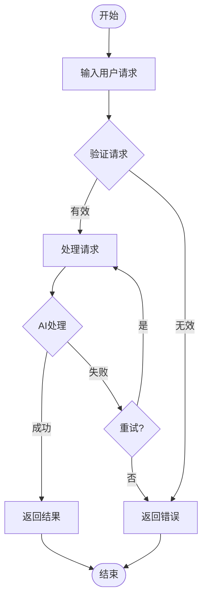
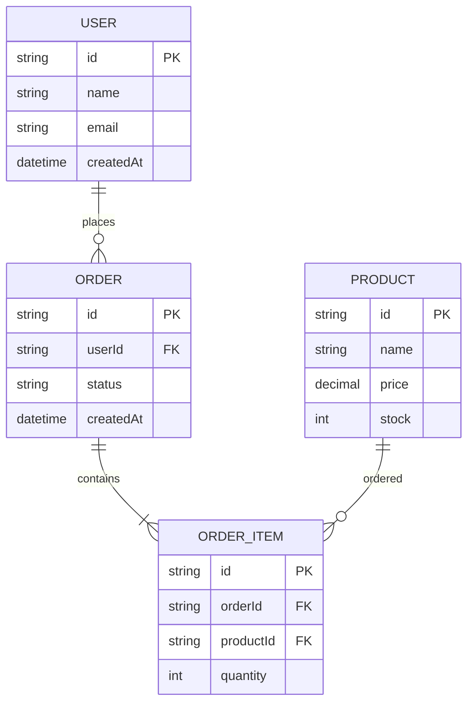

# YYC³ PortAISys - 需求分析与建模

> ***YanYuCloudCube***
> 言启象限 | 语枢未来
> ***Words Initiate Quadrants, Language Serves as Core for the Future***
> 万象归元于云枢 | 深栈智启新纪元
> ***All things converge in the cloud pivot; Deep stacks ignite a new era of intelligence***

---

> **文档版本**: v1.0
> **创建日期**: 2026-02-03
> **文档状态**: ✅ 已完成
> **维护团队**: YYC³ 产品团队

---

## 📋 目录

- [需求分析概述](#需求分析概述)
- [需求分析方法](#需求分析方法)
- [需求建模技术](#需求建模技术)
- [需求分析工具](#需求分析工具)
- [最佳实践](#最佳实践)

---

## 需求分析概述

### 分析目标

- 🎯 **需求清晰**: 确保需求清晰、完整、一致
- 📊 **需求可追踪**: 建立需求追溯机制
- ✅ **需求可验证**: 确保需求可测试、可验证
- 🔄 **需求可控**: 建立需求变更控制机制
- 📈 **需求价值**: 确保需求与业务价值对齐

### 分析原则

基于YYC³「五高五标五化」理念：

**五高**:
- **高可用**: 需求分析方法稳定可靠
- **高性能**: 需求分析高效快捷
- **高安全**: 需求信息安全可控
- **高扩展**: 需求分析可扩展性强
- **高可维护**: 需求模型易于维护

**五标**:
- **标准化**: 需求分析流程标准化
- **规范化**: 需求建模格式规范化
- **自动化**: 需求分析工具自动化
- **智能化**: 需求分析智能化
- **可视化**: 需求模型可视化

**五化**:
- **流程化**: 需求分析流程化
- **文档化**: 需求分析文档完整化
- **工具化**: 需求分析工具化
- **数字化**: 需求数据数字化
- **生态化**: 需求分析生态化

---

## 需求分析方法

### 业务需求分析

#### 1. 业务价值分析

**方法描述**: 评估需求对业务的价值和影响。

**分析维度**:
- 收入影响
- 成本影响
- 效率提升
- 用户体验
- 市场竞争力

**评估模型**:

```typescript
/**
 * 业务价值评估器
 */
class BusinessValueEvaluator {
  /**
   * 评估业务价值
   */
  evaluateBusinessValue(requirement: Requirement): BusinessValue {
    const revenueImpact = this.assessRevenueImpact(requirement);
    const costImpact = this.assessCostImpact(requirement);
    const efficiencyGain = this.assessEfficiencyGain(requirement);
    const userExperience = this.assessUserExperience(requirement);
    const marketCompetitiveness = this.assessMarketCompetitiveness(requirement);

    const overallScore = this.calculateOverallScore({
      revenueImpact,
      costImpact,
      efficiencyGain,
      userExperience,
      marketCompetitiveness
    });

    return {
      revenueImpact,
      costImpact,
      efficiencyGain,
      userExperience,
      marketCompetitiveness,
      overallScore,
      recommendation: this.generateRecommendation(overallScore)
    };
  }

  /**
   * 评估收入影响
   */
  private assessRevenueImpact(requirement: Requirement): number {
    const factors = [
      requirement.expectedRevenueIncrease,
      requirement.marketSize,
      requirement.pricingPower
    ];

    return this.weightedAverage(factors, [0.5, 0.3, 0.2]);
  }

  /**
   * 评估成本影响
   */
  private assessCostImpact(requirement: Requirement): number {
    const factors = [
      requirement.expectedCostReduction,
      requirement.operationalEfficiency,
      requirement.resourceOptimization
    ];

    return this.weightedAverage(factors, [0.4, 0.3, 0.3]);
  }

  /**
   * 评估效率提升
   */
  private assessEfficiencyGain(requirement: Requirement): number {
    const factors = [
      requirement.processImprovement,
      requirement.automationLevel,
      requirement.timeSavings
    ];

    return this.weightedAverage(factors, [0.4, 0.3, 0.3]);
  }

  /**
   * 评估用户体验
   */
  private assessUserExperience(requirement: Requirement): number {
    const factors = [
      requirement.usabilityImprovement,
      requirement.satisfactionIncrease,
      requirement.adoptionRate
    ];

    return this.weightedAverage(factors, [0.4, 0.3, 0.3]);
  }

  /**
   * 评估市场竞争力
   */
  private assessMarketCompetitiveness(requirement: Requirement): number {
    const factors = [
      requirement.differentiation,
      requirement.innovationLevel,
      requirement.marketTiming
    ];

    return this.weightedAverage(factors, [0.4, 0.3, 0.3]);
  }

  /**
   * 计算综合得分
   */
  private calculateOverallScore(scores: any): number {
    const weights = {
      revenueImpact: 0.25,
      costImpact: 0.20,
      efficiencyGain: 0.20,
      userExperience: 0.20,
      marketCompetitiveness: 0.15
    };

    return Object.entries(scores).reduce((total, [key, value]) => {
      return total + value * weights[key as keyof typeof weights];
    }, 0);
  }

  /**
   * 生成建议
   */
  private generateRecommendation(score: number): string {
    if (score >= 0.8) {
      return '高价值需求，强烈建议实施';
    } else if (score >= 0.6) {
      return '中高价值需求，建议实施';
    } else if (score >= 0.4) {
      return '中等价值需求，可考虑实施';
    } else if (score >= 0.2) {
      return '低价值需求，延后考虑';
    } else {
      return '极低价值需求，不建议实施';
    }
  }

  /**
   * 加权平均
   */
  private weightedAverage(values: number[], weights: number[]): number {
    const sum = values.reduce((total, value, index) => {
      return total + value * weights[index];
    }, 0);

    const weightSum = weights.reduce((total, weight) => total + weight, 0);

    return sum / weightSum;
  }
}

interface Requirement {
  expectedRevenueIncrease: number;
  expectedCostReduction: number;
  marketSize: number;
  pricingPower: number;
  operationalEfficiency: number;
  resourceOptimization: number;
  processImprovement: number;
  automationLevel: number;
  timeSavings: number;
  usabilityImprovement: number;
  satisfactionIncrease: number;
  adoptionRate: number;
  differentiation: number;
  innovationLevel: number;
  marketTiming: number;
}

interface BusinessValue {
  revenueImpact: number;
  costImpact: number;
  efficiencyGain: number;
  userExperience: number;
  marketCompetitiveness: number;
  overallScore: number;
  recommendation: string;
}
```

#### 2. 成本效益分析

**方法描述**: 分析需求的成本和效益，评估投资回报。

**分析步骤**:
1. 识别成本
   - 开发成本
   - 运维成本
   - 培训成本
   - 机会成本

2. 识别效益
   - 直接效益
   - 间接效益
   - 定量效益
   - 定性效益

3. 计算指标
   - 净现值（NPV）
   - 投资回报率（ROI）
   - 回收期
   - 效益成本比

**分析模型**:

```typescript
/**
 * 成本效益分析器
 */
class CostBenefitAnalyzer {
  /**
   * 执行成本效益分析
   */
  analyze(requirement: Requirement): CostBenefitAnalysis {
    const costs = this.calculateCosts(requirement);
    const benefits = this.calculateBenefits(requirement);
    const npv = this.calculateNPV(costs, benefits);
    const roi = this.calculateROI(costs, benefits);
    const paybackPeriod = this.calculatePaybackPeriod(costs, benefits);
    const benefitCostRatio = this.calculateBenefitCostRatio(costs, benefits);

    return {
      costs,
      benefits,
      npv,
      roi,
      paybackPeriod,
      benefitCostRatio,
      recommendation: this.generateRecommendation(npv, roi, paybackPeriod, benefitCostRatio)
    };
  }

  /**
   * 计算成本
   */
  private calculateCosts(requirement: Requirement): Costs {
    return {
      development: requirement.estimatedDevelopmentCost,
      maintenance: requirement.estimatedMaintenanceCost,
      training: requirement.estimatedTrainingCost,
      opportunity: requirement.estimatedOpportunityCost,
      total: requirement.estimatedDevelopmentCost +
              requirement.estimatedMaintenanceCost +
              requirement.estimatedTrainingCost +
              requirement.estimatedOpportunityCost
    };
  }

  /**
   * 计算效益
   */
  private calculateBenefits(requirement: Requirement): Benefits {
    const discountRate = 0.1; // 10%折现率
    const years = 5; // 5年

    const annualBenefits = {
      direct: requirement.estimatedAnnualDirectBenefit,
      indirect: requirement.estimatedAnnualIndirectBenefit,
      total: requirement.estimatedAnnualDirectBenefit +
               requirement.estimatedAnnualIndirectBenefit
    };

    const presentValue = this.calculatePresentValue(annualBenefits.total, discountRate, years);

    return {
      annual: annualBenefits,
      presentValue,
      total: presentValue
    };
  }

  /**
   * 计算净现值（NPV）
   */
  private calculateNPV(costs: Costs, benefits: Benefits): number {
    return benefits.presentValue - costs.total;
  }

  /**
   * 计算投资回报率（ROI）
   */
  private calculateROI(costs: Costs, benefits: Benefits): number {
    return ((benefits.presentValue - costs.total) / costs.total) * 100;
  }

  /**
   * 计算回收期
   */
  private calculatePaybackPeriod(costs: Costs, benefits: Benefits): number {
    const annualBenefit = benefits.annual.total;
    return costs.total / annualBenefit;
  }

  /**
   * 计算效益成本比
   */
  private calculateBenefitCostRatio(costs: Costs, benefits: Benefits): number {
    return benefits.presentValue / costs.total;
  }

  /**
   * 计算现值
   */
  private calculatePresentValue(annualBenefit: number, discountRate: number, years: number): number {
    let presentValue = 0;

    for (let year = 1; year <= years; year++) {
      presentValue += annualBenefit / Math.pow(1 + discountRate, year);
    }

    return presentValue;
  }

  /**
   * 生成建议
   */
  private generateRecommendation(
    npv: number,
    roi: number,
    paybackPeriod: number,
    benefitCostRatio: number
  ): string {
    if (npv > 0 && roi > 20 && paybackPeriod < 2 && benefitCostRatio > 2) {
      return '高投资回报，强烈建议实施';
    } else if (npv > 0 && roi > 10 && paybackPeriod < 3 && benefitCostRatio > 1.5) {
      return '中等投资回报，建议实施';
    } else if (npv > 0 && roi > 5 && paybackPeriod < 4 && benefitCostRatio > 1.2) {
      return '低投资回报，可考虑实施';
    } else {
      return '投资回报不足，不建议实施';
    }
  }
}

interface Costs {
  development: number;
  maintenance: number;
  training: number;
  opportunity: number;
  total: number;
}

interface Benefits {
  annual: {
    direct: number;
    indirect: number;
    total: number;
  };
  presentValue: number;
  total: number;
}

interface CostBenefitAnalysis {
  costs: Costs;
  benefits: Benefits;
  npv: number;
  roi: number;
  paybackPeriod: number;
  benefitCostRatio: number;
  recommendation: string;
}
```

### 技术需求分析

#### 1. 技术可行性分析

**方法描述**: 评估需求的技术可行性和实现难度。

**分析维度**:
- 技术成熟度
- 技术复杂度
- 技术风险
- 技术依赖
- 技术资源

**评估模型**:

```typescript
/**
 * 技术可行性评估器
 */
class TechnicalFeasibilityEvaluator {
  /**
   * 评估技术可行性
   */
  evaluate(requirement: Requirement): TechnicalFeasibility {
    const maturity = this.assessMaturity(requirement);
    const complexity = this.assessComplexity(requirement);
    const risk = this.assessRisk(requirement);
    const dependencies = this.assessDependencies(requirement);
    const resources = this.assessResources(requirement);

    const overallScore = this.calculateOverallScore({
      maturity,
      complexity,
      risk,
      dependencies,
      resources
    });

    return {
      maturity,
      complexity,
      risk,
      dependencies,
      resources,
      overallScore,
      recommendation: this.generateRecommendation(overallScore)
    };
  }

  /**
   * 评估技术成熟度
   */
  private assessMaturity(requirement: Requirement): number {
    const factors = [
      requirement.technologyMaturity,
      requirement.communitySupport,
      requirement.documentationQuality,
      requirement.stabilityLevel
    ];

    return this.weightedAverage(factors, [0.3, 0.25, 0.25, 0.2]);
  }

  /**
   * 评估技术复杂度
   */
  private assessComplexity(requirement: Requirement): number {
    const factors = [
      requirement.architecturalComplexity,
      requirement.integrationComplexity,
      requirement.dataComplexity,
      requirement.algorithmicComplexity
    ];

    return this.weightedAverage(factors, [0.3, 0.25, 0.25, 0.2]);
  }

  /**
   * 评估技术风险
   */
  private assessRisk(requirement: Requirement): number {
    const factors = [
      requirement.technologyRisk,
      requirement.implementationRisk,
      requirement.maintenanceRisk,
      requirement.scalabilityRisk
    ];

    return this.weightedAverage(factors, [0.3, 0.25, 0.25, 0.2]);
  }

  /**
   * 评估技术依赖
   */
  private assessDependencies(requirement: Requirement): number {
    const factors = [
      requirement.externalDependencies,
      requirement.internalDependencies,
      requirement.thirdPartyServices,
      requirement.hardwareRequirements
    ];

    return this.weightedAverage(factors, [0.3, 0.25, 0.25, 0.2]);
  }

  /**
   * 评估技术资源
   */
  private assessResources(requirement: Requirement): number {
    const factors = [
      requirement.availableSkills,
      requirement.availableTools,
      requirement.availableInfrastructure,
      requirement.availableBudget
    ];

    return this.weightedAverage(factors, [0.3, 0.25, 0.25, 0.2]);
  }

  /**
   * 计算综合得分
   */
  private calculateOverallScore(scores: any): number {
    const weights = {
      maturity: 0.25,
      complexity: 0.20,
      risk: 0.20,
      dependencies: 0.20,
      resources: 0.15
    };

    return Object.entries(scores).reduce((total, [key, value]) => {
      return total + value * weights[key as keyof typeof weights];
    }, 0);
  }

  /**
   * 生成建议
   */
  private generateRecommendation(score: number): string {
    if (score >= 0.8) {
      return '技术可行性高，可以实施';
    } else if (score >= 0.6) {
      return '技术可行性较高，可以实施但需注意风险';
    } else if (score >= 0.4) {
      return '技术可行性中等，需要进一步评估';
    } else if (score >= 0.2) {
      return '技术可行性较低，不建议实施';
    } else {
      return '技术可行性极低，不能实施';
    }
  }

  /**
   * 加权平均
   */
  private weightedAverage(values: number[], weights: number[]): number {
    const sum = values.reduce((total, value, index) => {
      return total + value * weights[index];
    }, 0);

    const weightSum = weights.reduce((total, weight) => total + weight, 0);

    return sum / weightSum;
  }
}

interface TechnicalFeasibility {
  maturity: number;
  complexity: number;
  risk: number;
  dependencies: number;
  resources: number;
  overallScore: number;
  recommendation: string;
}
```

---

## 需求建模技术

### 用例建模

#### 用例图

**描述**: 用例图描述系统与外部参与者之间的交互。

**用例图元素**:
- 参与者（Actor）
- 用例（Use Case）
- 系统边界（System Boundary）
- 关系（Relationship）

**用例图示例**:

```mermaid
useCaseDiagram
    actor "用户" as User
    actor "管理员" as Admin
    actor "系统" as System

    package "YYC³ PortAISys" {
        usecase "AI对话" as UC1
        usecase "工作流管理" as UC2
        usecase "数据分析" as UC3
        usecase "系统监控" as UC4
        usecase "用户管理" as UC5
    }

    User --> UC1
    User --> UC2
    User --> UC3
    Admin --> UC4
    Admin --> UC5
    System --> UC4
```

### 业务流程建模

#### 业务流程图

**描述**: 业务流程图描述业务流程的步骤和决策点。

**业务流程图元素**:
- 开始/结束事件
- 活动（Activity）
- 决策（Decision）
- 网关（Gateway）
- 流向（Flow）

**业务流程图示例**:



### 数据建模

#### 实体关系图

**描述**: 实体关系图描述系统中的实体及其关系。

**实体关系图元素**:
- 实体（Entity）
- 属性（Attribute）
- 关系（Relationship）
- 基数（Cardinality）

**实体关系图示例**:



---

## 需求分析工具

### 分析工具

| 工具 | 用途 | 优点 | 缺点 |
| ---- | ---- | ---- | ---- |
| **Jira** | 需求跟踪、项目管理 | 功能强大、可定制 | 学习成本高 |
| **Confluence** | 需求文档、协作 | 协作方便、文档丰富 | 搜索功能一般 |
| **Visio** | 流程图、用例图 | 图表丰富、易用 | 需要授权 |
| **Draw.io** | 流程图、用例图 | 免费、易用 | 功能相对简单 |
| **Lucidchart** | 流程图、用例图 | 协作方便、功能丰富 | 需要订阅 |

### 工具配置

#### Jira需求跟踪配置

```yaml
# Jira需求跟踪配置
project:
  name: "YYC³ PortAISys"
  key: "YYC3"
  
issue_types:
  - name: "Epic"
    description: "大型功能或主题"
  - name: "Story"
    description: "用户故事"
  - name: "Task"
    description: "开发任务"
  - name: "Bug"
    description: "缺陷"
  - name: "Spike"
    description: "调研任务"

fields:
  - name: "需求类型"
    type: "select"
    options:
      - "功能需求"
      - "非功能需求"
      - "约束条件"
      - "接口需求"
  - name: "业务价值"
    type: "number"
    min: 0
    max: 10
  - name: "技术复杂度"
    type: "number"
    min: 0
    max: 10
  - name: "技术风险"
    type: "number"
    min: 0
    max: 10
  - name: "依赖关系"
    type: "multi-select"
    options:
      - "无依赖"
      - "有依赖"
      - "阻塞其他需求"
      - "被其他需求阻塞"
```

---

## 最佳实践

### 分析最佳实践

1. **多维度分析**: 从多个维度分析需求，确保分析全面
2. **数据驱动**: 使用数据支持分析结论，提高分析准确性
3. **工具辅助**: 使用专业工具提高分析效率
4. **团队协作**: 邀请相关方参与分析，确保分析全面
5. **文档记录**: 详细记录分析过程和结果，便于追溯

### 建模最佳实践

1. **选择合适模型**: 根据需求类型选择合适的建模技术
2. **保持简洁**: 模型应该简洁明了，避免过度复杂
3. **持续更新**: 随着需求变化及时更新模型
4. **验证模型**: 验证模型的准确性和完整性
5. **文档化**: 对模型进行文档化，便于理解和使用

---

## 下一步

- [需求规格说明](./04-需求规格说明.md) - 学习需求规格编写
- [需求优先级管理](./05-需求优先级管理.md) - 学习优先级管理
- [需求跟踪矩阵](./08-需求跟踪矩阵.md) - 学习需求跟踪

---

<div align="center">

> 「***YanYuCloudCube***」
> 「***<admin@0379.email>***」
> 「***Words Initiate Quadrants, Language Serves as Core for the Future***」
> 「***All things converge in the cloud pivot; Deep stacks ignite a new era of intelligence***」

</div>
